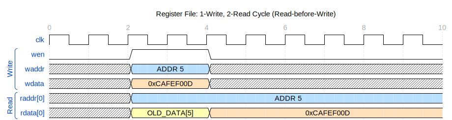

# Datasheet: register_file

Version: v1.0.0

Last Updated: 2025-08-04

## 1. Overview

The `register_file` is a flexible, synthesizable SystemVerilog module that implements a high-performance register file with one synchronous write port and a parameterizable number of asynchronous read ports. It is designed to be a core component in processor designs, particularly those requiring concurrent data access, such as in the execution stage of a pipelined CPU. Key features include a configurable register count and data width, and an optional mode to enforce that register 0 is hardwired to zero, making it directly compatible with the RISC-V integer instruction set architecture (ISA).

## 2. Features

* Single, synchronous write port.
* Parameterizable number of asynchronous read ports.
* Parameterizable register count (`REG_COUNT`) and data width (`DEPTH`).
* Optional RISC-V compatible zero-register functionality (register at address 0 is always zero).
* Fully synchronous design with a single clock domain for writes.
* Active-low asynchronous reset to initialize all registers to zero.
* Standard "read-before-write" behavior for simultaneous read/write to the same address.

## 3. Block Diagram

*(A conceptual block diagram is shown below. The number of read ports is determined by the `NUM_READ_PORTS` parameter.)*

## 4. Parameters (Generics)

A table describing the parameters that can be set at instantiation time to configure the module's behavior or size.

| **Parameter**  | **Type** | **Default** | **Description**                                                                                                                         |
| -------------------- | -------------- | ----------------- | --------------------------------------------------------------------------------------------------------------------------------------------- |
| `NUM_READ_PORTS`   | `int`        | `2`             | Defines the number of concurrent read ports.                                                                                                  |
| `REG_COUNT`        | `int`        | `32`            | Defines the total number of registers in the file.                                                                                            |
| `DEPTH`            | `int`        | `32`            | Defines the bit width of each individual register.                                                                                            |
| `ZERO_REG_IS_ZERO` | `bit`        | `1`             | If `1`, register at address `0`i s hardwired to zero. Writes to address `0` are ignored. If `0`, register `0` is a normal register. |

## 5. Port Descriptions

A detailed table of all input and output ports.

| **Port Name** | **Direction** | **Width**                                 | **Description**                                                                                |
| ------------------- | ------------------- | ----------------------------------------------- | ---------------------------------------------------------------------------------------------------- |
| `clk`             | `input`           | `1`                                           | System clock. All synchronous write logic is clocked on the positive edge of this signal.            |
| `rst_n`           | `input`           | `1`                                           | Active-low asynchronous system reset. When asserted (`0`), all registers are cleared to zero.      |
| `waddr`           | `input`           | `$clog2(REG_COUNT)`                           | Write address. Selects the register to be written to.                                                |
| `wdata`           | `input`           | `DEPTH`                                       | Write data. The data to be written into the selected register.                                       |
| `wen`             | `input`           | `1`                                           | Write enable. A high level on this signal enables a write operation on the next positive clock edge. |
| `raddr`           | `input`           | `[NUM_READ_PORTS-1:0][$clog2(REG_COUNT)-1:0]` | Packed array of read addresses.`raddr[i]` is the address for the i-th read port.                   |
| `rdata`           | `output`          | `[NUM_READ_PORTS-1:0][DEPTH-1:0]`             | Packed array of read data.`rdata[i]` is the data output from the i-th read port.                   |

## 6. Functional Description

The `register_file_parametric` module provides a simple and efficient memory structure commonly used in CPUs. Its operation is divided into three main functions: write, read, and reset.

### Write Operation

A write operation is performed when the `wen` (write enable) signal is asserted high. On the next rising edge of `clk`, the data present on the `wdata` bus is written into the register selected by the `waddr` bus. The write is synchronous.

If the `ZERO_REG_IS_ZERO` parameter is set to `1`, any attempt to write to address `0` (`waddr == '0`) will be ignored, and the contents of register 0 will remain zero.

### Read Operation

Read operations are asynchronous (combinatorial). The module supports `NUM_READ_PORTS` concurrent reads. For each read port `i`, the address on `raddr[i]` is used to select a register. The contents of that register are then immediately presented on the corresponding `rdata[i]` output bus.

If a read and a write occur to the same address in the same clock cycle, the read port will output the *old* data stored in the register before the write completes. This is standard "read-before-write" behavior.

If the `ZERO_REG_IS_ZERO` parameter is set to `1`, any read from address `0` (`raddr[i] == '0`) will result in `rdata[i]` being driven to all zeros, regardless of the physical value stored in register 0.

### Reset

The module uses an active-low asynchronous reset (`rst_n`). When `rst_n` is pulled low, all physical registers within the file are immediately and asynchronously set to zero.

## 7. Revision History

A log of changes to this document and the corresponding RTL module.

| **Version** | **Date** | **Author(s)** | **Changes**               |
| ----------------- | -------------- | ------------------- | ------------------------------- |
| `v1.0.0`        | 2025-08-04     | Adrià Babiano Novella   | Initial draft of the datasheet. |
